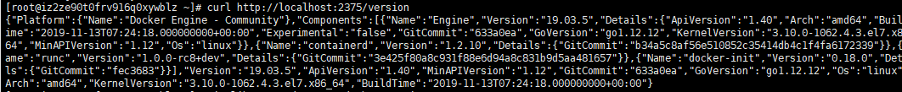
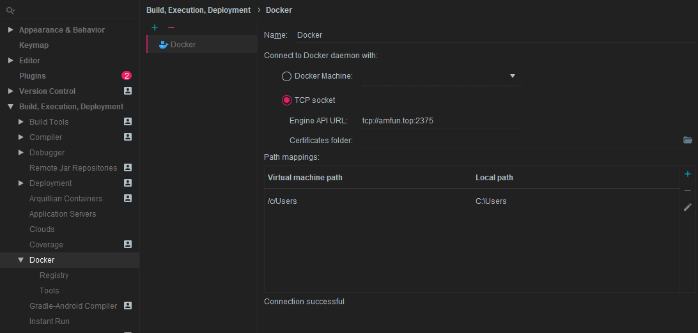
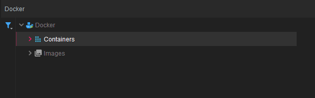
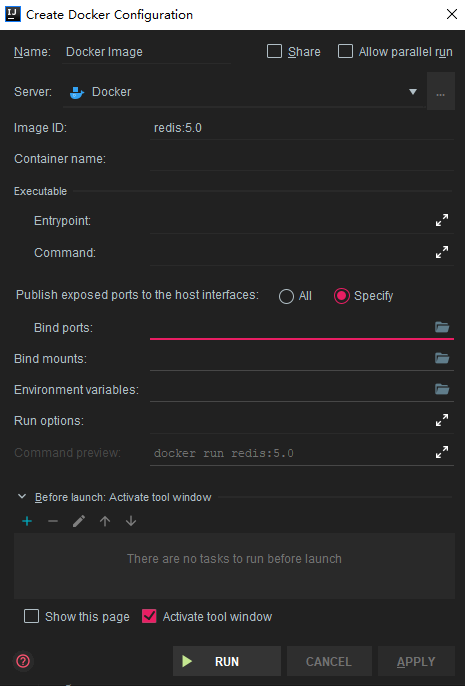

# IDEA插件之Docker

## 准备

* Idea安装Docker插件

* 安装docker

## 开启Docker远程访问

在root账号下修改docker配置文件

``` shell
vi /lib/systemd/system/docker.service

```


``` shell 
注释ExecStart行

添加 ExecStart=/usr/bin/dockerd -H tcp://0.0.0.0:2375 -H unix://var/run/docker.sock（centos7系统）
```

**如果是centos7以下的话，就把ExecStart修改为**

``` shell
ExecStart=/usr/bin/dockerd -H fd:// -H tcp://0.0.0.0:2375
```

保存修改，重新加载配置

``` shell
systemctl reload daemon
```

重启docker服务

``` shell
service docker restart
```

测试本地连接

``` shell
curl http://localhost:2375/version
```

如下，输出：



## 配置连接远程Docker

在idea中添加远程docker的访问地址



之后便可以在idea主页看到docker信息，可以看到docker中的容器和镜像文件，可视化的对容器或者镜像进行操作，十分方便不在演示。



## 创建容器

通过右键镜像文件，选择创建容器，简单配置即可



## 一键部署应用

### 使用Maven插件方式

``` xml
<build>
        <!-- 引用我们的项目名字 -->
        <finalName>${project.artifactId}</finalName>

        <plugins>
            <plugin>
                <groupId>org.springframework.boot</groupId>
                <artifactId>spring-boot-maven-plugin</artifactId>
            </plugin>


            <!--使用docker-maven-plugin插件-->
            <plugin>
                <groupId>com.spotify</groupId>
                <artifactId>docker-maven-plugin</artifactId>
                <version>1.0.0</version>
                <!--将插件绑定在某个phase执行-->
                <executions>
                    <execution>
                        <id>build-image</id>
                        <!--用户只需执行mvn package ，就会自动执行mvn docker:build-->
                        <phase>package</phase>
                        <goals>
                            <goal>build</goal>
                        </goals>
                    </execution>
                </executions>

                <configuration>
                    <!--指定生成的镜像名,这里是我们的作者名+项目名-->
                    <imageName>cainiao/${project.artifactId}</imageName>

                    <!--指定标签 这里指定的是镜像的版本，我们默认版本是latest-->
                    <imageTags>
                        <imageTag>latest</imageTag>
                    </imageTags>

                    <!--指定基础镜像jdk1.8-->
                    <baseImage>java</baseImage>
                    <!--
                    镜像制作人本人信息
                    <maintainer>bruceliu@email.com</maintainer>
                    -->
                    <!--切换到ROOT目录-->
                    <workdir>/ROOT</workdir>

                    <!--查看我们的java版本-->
                    <cmd>["java", "-version"]</cmd>

                    <!--${project.build.finalName}.jar是打包后生成的jar包的名字-->
                    <entryPoint>["java", "-jar", "/${project.build.finalName}.jar"]</entryPoint>

                    <!--指定远程 docker api地址-->
                    <dockerHost>http://192.168.29.133:2375</dockerHost>

                    <!-- 这里是复制 jar 包到 docker 容器指定目录配置 -->
                    <resources>
                        <resource>
                            <targetPath>/</targetPath>
                            <!--jar 包所在的路径  此处配置的 即对应 target 目录-->
                            <directory>${project.build.directory}</directory>
                            <!--用于指定需要复制的文件 需要包含的 jar包 ，这里对应的是 Dockerfile中添加的文件名　-->
                            <include>${project.build.finalName}.jar</include>
                        </resource>
                    </resources>

                </configuration>
            </plugin>
        </plugins>
    </build>
```

在Maven中清理clean之后重新打包就会在你的远程docker的images中显示你打包的文件。

### 使用dockerfile方式