# Jenkins

## 安装

1.msi的win安装，安装完成会在win系统中自动注册jenkins服务，默认可以直接访问8080

+ 修改端口，在jenkins安装目录`jenkins.xml`
+ 停止/启动服务，win默认开机会启动，可在任务管理->服务->开启/关闭

2.war包形式，安装包根目录，执行命令`java -jar jenkins.war --httpPort=7080`

注：两种方式不同

## 配置

参考[Jenkins自动化部署入门](https://www.cnblogs.com/wfd360/p/11314697.html)

码云Jenkins[Jenkins插件使用教程](https://gitee.com/help/articles/4193#article-header0)

## 示例

### Springboot+Maven+码云+阿里云使用Jenkins自动构建项目

#### 先决条件

1.安装Jenkins

2.创建码云仓库

3.本地安装Jdk，Maven，Git

#### Jenkins基础配置

在左侧菜单栏`Manage Jenkins`中配置相关信息

##### 配置必要插件

在Manage Jenkins -> Manage Plugins中，安装以下插件

+ Publish over SSH，通过SSH连接远程服务器
+ Deploy to container Plugin，将打包文件推送至服务器

##### Configure System

配置最后一项`Public over SSH`

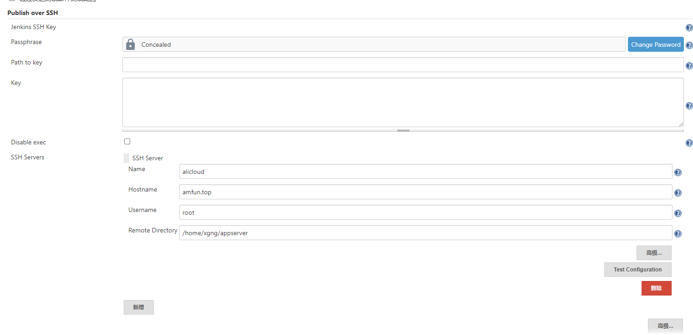

> + Passphrase，服务器SSH登陆密码
> + Name：配置名称，无所谓
> + Hostname：服务器地址
> + Remote Directory：远程文件夹地址

##### **Configure Global Security** 

主要是一些安全配置

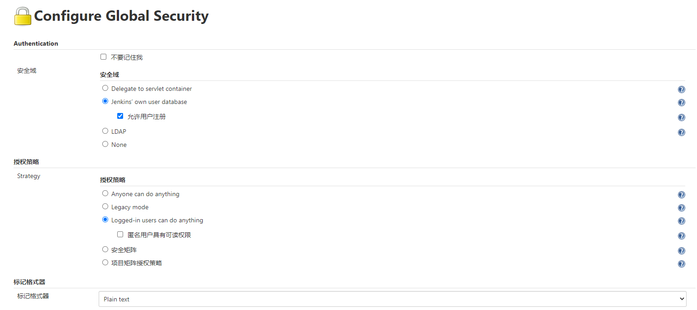

##### Global Tool Configuration

全局工具配置，主要是指定编译环境的一些配置信息，指定本地JDK，Maven，Git环境

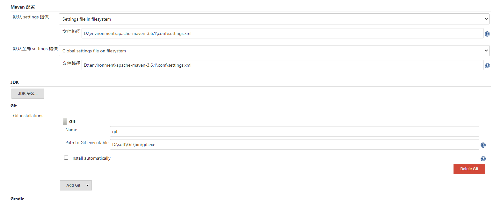

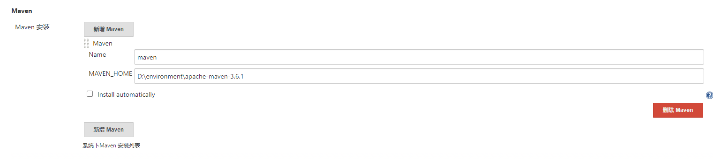

#### 码云配置

安装插件`Gitee`

##### 添加码云链接配置

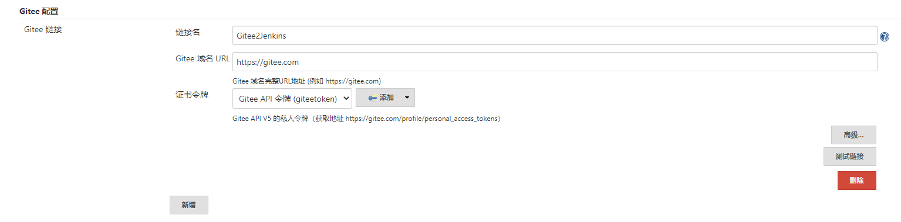

1. 前往 Jenkins -> Manage Jenkins -> Configure System -> Gitee Configuration -> Gitee connections

2. 在 `Connection name` 中输入 `Gitee` 或者你想要的名字

3. `Gitee host URL` 中输入码云完整 URL地址： `https://gitee.com` （码云私有化客户输入部署的域名）

4. `Credentials`中如还未配置码云 APIV5 私人令牌，点击
   1. `Domain` 选择 `Global credentials`
   2. `Kind` 选择 `Gitee API Token`
3. `Scope` 选择你需要的范围
   4. `Gitee API Token` 输入你的码云私人令牌，获取地址：https://gitee.com/profile/personal_access_tokens
5. `ID`, `Descripiton` 中输入你想要的 ID 和描述即可。
   
5. `Credentials` 选择配置好的 Gitee APIV5 Token

6. 点击 `Test Connection` 测试链接是否成功

#### 新建构建任务

前往 Jenkins -> New Item , name 输入 'GiteeTest'，选择 `Freestyle project` 保存即可创建构建项目。

##### 源码管理

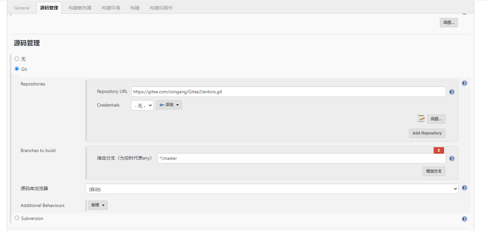

主要是对于源码仓库地址填写。

##### 构建触发器

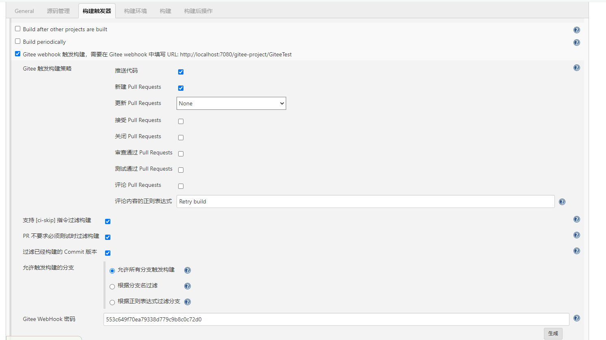

Gitee Webhook密码用于码云配置，如果不生成码云不需要填写。

##### 构建

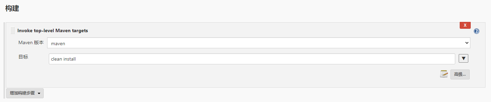

配置Maven构建语句

##### 构建后操作

选择`增加构建后操作步骤` -> `Send build artifacts over SSH`

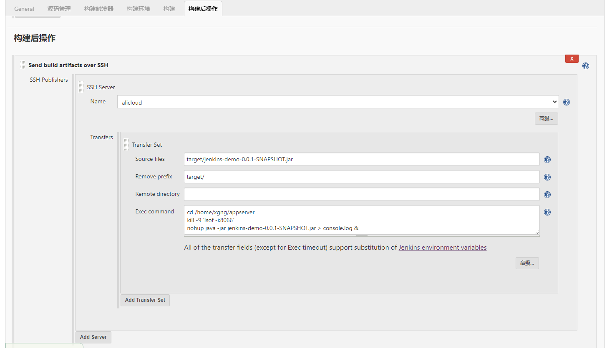

> + Name，之前的SSH服务器配置名称
> + Source file，Jar包相对路径
> + Exec command，服务器执行命令`

添加码云相关配置

+ `将构建状态评论到 Giteee Pull Request中`
+ `当构建成功自动合并Gitee的Pull Request`

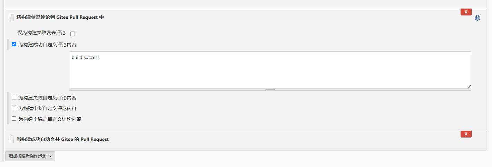

#### 码云仓库WebHooks

URL：需要时公网IP，本次使用花生壳映射本地Jenkins，端口，填写码云相对路径`gitee-project/GiteeTest`

WebHooks密码：Jenkins中的码云配置生成，如果无可不填写

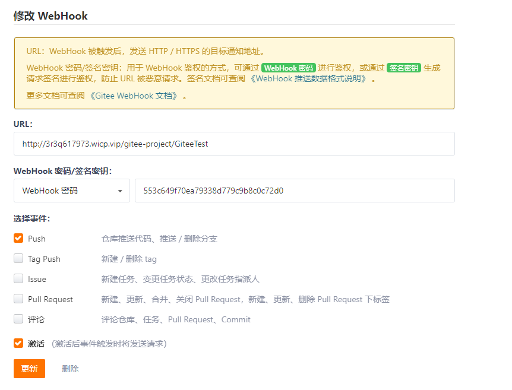

#### 测试构建

+ 触发构建

  第一种：同步代码后在，码云WebHooks中单击`测试`，观察Jenkins构建结果

  第二种：推动代码到码云自动触发

* 在Jenkins中查看构建历史
* 在服务器查看/home/xgng/appserver，存在jar包
* 访问`amfun.top:8066/hi`

