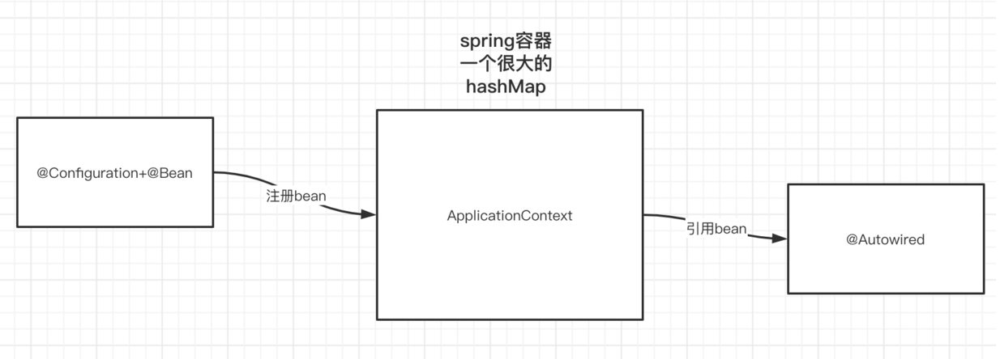

关于spring的`@bean`和`@Configuration`注解
如果spring扫描到一个类加了@Configuration注解，那么这个类下面的@bean注解的返回对象就会注册到spring的容器里面
然后就能通过@Autowired注解获取bean



因此，需要通过一个配置类将实例加入到`bean`中，具体实现步骤如下：

> 1. 创建一个maven工程，写一个自己的`@Configuration`类
> 2. 在META-INF文件夹下面创建spring.factories文件，配置自己刚刚的Configuration类路径。
> 3. 打包到仓库，`mvn install`打包到本地maven仓库。
> 4. 新建springboot工程引用刚刚的包依赖。

### 配置类configuration

``` java
@Configuration
// 导入我们自定义的配置类,供当前类使用
@EnableConfigurationProperties(DemoConfigProperties.class)
// 当存在某个类时，此自动配置类才会生效,这里可以使用外部的String类名
//@ConditionalOnClass(Demo.class)
// 只有web应用程序时此自动配置类才会生效
//@ConditionalOnWebApplication
public class DemoStarterAutoConfiguration {
    @Bean
    @ConditionalOnProperty(prefix = "demo.config", name = "enable", havingValue = "true")
    public Demo defualtDemo(DemoConfigProperties demoConfigProperties) {
        Demo demo = new Demo();
        demo.setAge(demoConfigProperties.getAge());
        demo.setName(demoConfigProperties.getName());
        return demo;
    }
}
```

### 参数配置项

`@ConfigurationProperties`注解可以读取`yml`中的配置信息，`prefix`指定自动读取匹配此前缀的参数信息。

``` java
@ConfigurationProperties(prefix = "demo.config")
public class DemoConfigProperties {
    private String name;
    private int age;
    // getter setter
    ...
}
```

