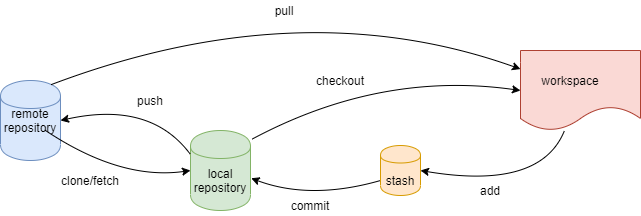

# Git常用命令



解释：

> + workspace：工作区，本地修改的文件
> + stash：暂存区，`git add`提价内容
> + local repository：本地仓库
> + remote repository：远程仓库

## 新建代码库

初始化本地仓库，在文件夹内使用

```shell
# 在当前目录创建Git代码库
$ git init 
# 新建目录`project-name`，并初始化为Git代码库
$ git init <project-name>
# 下载一个远程Git项目和它的历史记录
$ git clone <url>
```

## 配置

在用户主目录下（全局配置），往往项目会存在`.gitconfig`

``` shell
# 显示git配置
$ git config --list
# 编辑git配置文件
$ git config -e <--global>

# 设置提交代码时的用户信息
$ git config <--global> user.name "<name>"
$ git config <--global> user.email "<email address>"
```

## 增加/删除文件

``` shell
# 添加指定文件到暂存区
$ git add <file> <file> ...
# 添加指定目录到暂存区，包括子目录
$ git add <dir>
# 添加当前目录说有文件到暂存区
$ git add .
# 删除工作区文件，并将删除放入暂存区
$ git rm <file> <file>...
# 停止追踪指定文件
$ git rm --cached <file>
# 改名文件，并且将这个改名放入暂存区
$ git mv <file-original> <file-renamed>
```

## 代码提交

``` shell
# 提交暂存区到本地仓库
$ git commit -m "<message>"
# 提交指定文件到仓库区
$ git commit <fiel1> <file2> ... -m "<message>"
# 提交时显示所有diff信息
$ git commit -v
# 提交工作区自上次commit之后的变化，直接到仓库
$ git commit -a
```

## 分支branch

### 查看

``` shell
# 列出所有本地分支
$ git branch
# 列出说有远程分支
$ git branch -r
# 列出所有本地和远程分支
$ git branch -a
# 列出所有本地分支和远程分支的对应关系
$ git branch -vv
```

### 创建分支

``` shell
# 创建分支
$ git branch <branch_name>
# 切换并创建
$ git checkout -b <branch_name>
```

### 切换分支

``` shell
# 切换分支
$ git checkout <branch_name>`
# 同步一个远程新建分支，本地没有该分支
git checkout --track origin/<branch_name>
```

### 删除分支

``` shell
# 删除本地分支
$ git branch -d <branch_name>
# 删除远程分支
$ git  branch -r -d origin/<branch_name>
```

### 合并分支

+ `git merge <branch-name>`，合并指定分支到当前分支

## 标签

``` shell
# 列出所以tag
$ git tag
新建一个tag在当前commit
$ git tag <tag>
# 新建一个tag在指定commit
$ git tag <tag> <commit>
# 删除本地tag
$ git tag -d <tag>
# 删除远程tag
$ git push origin :refs/tags/<tagName>
# 查看tag信息
$ git show <tag>
# 提交指定tag
$ git push <remote> <tag>
# 提交所有tag
$ git push <remote> --tags
# 新建一个分支，指向某个tag
$ git checkout -b <branch> <tag>
```

## 查看信息

``` shell
# 显示有变更的文件
$ git status
#  显示当前分支的版本历史
$ git log
# 显示commit历史，以及每次提交变更文件
$ git log --stat
# 搜索提交历史，根据关键词
$ git log -S <keyword>
# 显示暂存区和工作区的差异
$ git diff
# 显示暂存区和上一个commit的差异
$ git diff --cached <file>
# 显示工作区和当前分支最新commit之间的差异
$ git diff HEAD
# 显示今天写了多少行
$ git diff --shortstat "@{0 day ago}"
```

## 远程同步

``` shell
# 下载远程仓库的所有变动
$ git fetch <remote>
# 显示所以远程仓库
$ git remote -v
# 显示某个远程仓库的信息
$  git remote show <remote>
# 增加一个新的远程仓库，并命名
$ git remote add <shortname> <url>
# 取回远程仓库的变化，并与本地分支合并
$ git pull <remote> <branch>
# 上传本地指定分支到远程仓库
$ git push <remote> <branch>
# 推送所有分支到远程仓库
$ git push <remote> --all
```

<kbd>tip</kbd>: 

**git fetch与git pull区别**

> 1. git fetch：相当于是从远程获取最新版本到本地，不会自动 merge
> 2. git pull：相当于是从远程获取最新版本并 merge 到本地

git fetch 更安全一些。因为在 merge 前，我们可以查看更新情况，然后再决定是否合并结束。

## 撤销

``` shell
# 恢复暂存区的指定文件到工作区
$ git checkout <file>
# 恢复某个commit的指定文件到暂存区和工作区
$ git checkout <commit> <file>
# 恢复暂存区的所有文件到工作区
$ git checkout .
# 重置暂存区的指定文件，与上一次commit保持一致，但工作区不变
$ git reset <file>
# 重置暂存区与工作区，与上一个commit保持一致
$ git reset --hard
# 重置当前分支的指针为指定commit，同时重置暂存区，但工作区不变
$ git reset <commit>
# 重置当前分支的HEAD为指定commit，同时重置暂存区和工作区，与指定commit一致
$ git reset --hard [commit]

# 重置当前HEAD为指定commit，但保持暂存区和工作区不变
$ git reset --keep [commit]
```

### stash命令

``` shell
# 执行存储时，添加备注，方便查找，只有 git stash 也要可以的，但查找时不方便识别。
$ git stash save "save message"  : 
# 查看所有stash
$ git stash list
# 显示做了哪些改动
$ git stash show
# 命令恢复之前缓存的工作目录，默认为第一个 stash, 即 stash@{0}
$ git stash pop 
# 将缓存堆栈中的对应 stash 删除，并将对应修改应用到当前的工作目录下
$ git stash pop stash@{$num}
# 删除所有缓存的 stash
$ git stash clear
```

## 比较提交 git diff

``` shell
# 显示工作目录 (working tree) 与索引区 (即暂存区快照，index，就是 git add 过的) 之间的文件变更，即显示未被 add 的文件变更。
$ git diff
# 显示索引区和最后一次 commit (HEAD) 之间的文件更改，即显示已 add 但还未 commit 的文件变更。也即用 "git commit"（不带 - a）将被提交的文件变更。
$ git diff --cached 或 git diff --staged 
# 显示工作目录与最后一次 commit 之间的文件变更，即显示所有未 commit（包括未 add 和 add 两类）的文件变更。也即用 "git commit -a” 将被提交的文件变更。 
$ git diff HEAD
# 比较两个分支上最后 commit 的内容的差别。
$ git diff <分支名 1> < 分支名 2> 
```

## 打包

``` shell
# 生成一个可供发布的压缩包
$ git archive
```

## 场景示例

### 远程关联

步骤：

+ 本地初始化，`git init`，`git add .`，`git commit -m 'init repository'`
+ 建立远程仓库关联，`git remote add origin [Url]` 
+ 本地分支关联远程，`git branch --set-upstream-to=orgin/<romote_branch>  local_branch`，或者直接推送并关联，`git push --set-upstream origin master` 

  